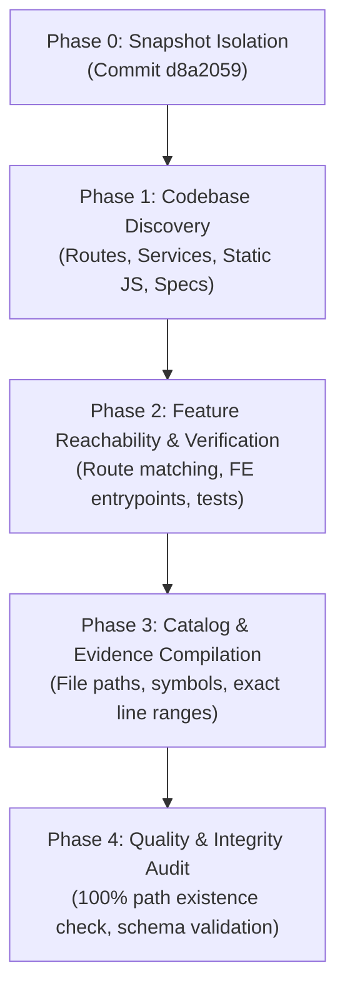

# Odysseus Functional Audit Methodology

## Purpose

This document specifies the methodology and evidence standards for the read-only discovery audit of **Odysseus**.

## Snapshot Baseline

- **Repository**: `odysseus-dev/odysseus`
- **Audit Target Branch**: `discovery`
- **Frozen Commit SHA**: `d8a2059df8e53bc7275c45339849d14c8651e73c`
- **Snapshot Date**: `2026-07-23T14:49:02Z`
- **Audit Mode**: Read-Only inventory & documentation review

## Rules of Engagement

1. **No Code Mutations**: Application code and tests outside `docs/discovery/` remain untouched.
2. **No External Operations**: No GitHub issues, PRs, comments, labels, or branch mutations.
3. **Zero Inferred Success**: Documentation claims require empirical evidence of implementation and reachability. Filenames, README descriptions, and docstrings alone do not constitute proof.
4. **Strict Status Categorization**: All capabilities are assigned exactly one authorized status:
   - `verified`: Implemented, reachable, and supported by code evidence.
   - `partial`: Partially implemented or missing full frontend/backend connection.
   - `disabled`: Gated off by default feature flags or configuration.
   - `experimental`: Active but requiring non-standard hardware or runtimes.
   - `legacy`: Obsolete feature retained for backwards compatibility.
   - `dead-code-candidate`: Code exists but is unreachable from UI or API routes.
   - `unverified`: Implementation present but untestable without external secrets or hardware.

## Evidence Maturity Scale

Evidence maturity is evaluated independently from catalog feature status. A feature status such as `verified` records that implementation was identified during discovery; it is not a statement that every evidence locator, test claim, line range, or runtime behaviour has passed semantic validation.

- **E0 - Discovered**: Candidate identified in documentation, route declaration, or source file.
- **E1 - Code-path traced**: Frontend/API entry point connected through services and data handlers.
- **E2 - Test-backed**: At least one directly relevant automated test assertion supports the feature claim. A test file's existence, an unrelated assertion, or an invalid test locator does not establish E2.
- **E3 - Runtime-validated**: Maintainer reproduced behavior in a recorded local environment.
- **E4 - Maintainer-accepted**: Maintainers accepted the feature description and support status.

## Audit Workflow

### Phase 0: Snapshot Isolation
The audit is pinned to git commit `d8a2059df8e53bc7275c45339849d14c8651e73c`. All file paths, symbol declarations, and line ranges map strictly to this commit.

### Phase 1: Codebase Discovery
All top-level and nested directories were traversed, including:
- Backend Entry Points (`app.py`, `routes/`, `routes/*/*.py`, `companion/`)
- Core Framework (`core/database.py`, `core/session_manager.py`, `core/auth.py`)
- Business Logic Services (`src/`, `services/`, `mcp_servers/`)
- Frontend Assets (`static/app.js`, `static/js/`, `static/index.html`)
- Test Suites (`tests/`, `tests/cli/`, `tests/streaming/`)
- Operations & Docker (`Dockerfile`, `docker-compose*.yml`, `scripts/`)

### Phase 2: Verification Protocol
For each feature candidate, the following table was evaluated:
- **User Reachability**: Frontend UI element, modal, route, or CLI script.
- **API Entrypoint**: FastAPI `@router` declaration or WebSocket/SSE handler.
- **Backend Execution**: Concrete Python module method, service, or tool call.
- **Data Persistence**: Disk file, SQLite table, or vector collection.
- **Test Coverage**: Automated test file executing assertions against the component.

### Phase 3: Evidence Linking Standard
Every feature entry in `feature-catalog.json` contains a structured `evidence` list with:
- `path`: Relative path from repository root.
- `symbol`: Route, class, function, or element symbol name.
- `line_range`: Inclusive line range (e.g. `L120-L250`).
- `explanation`: Short factual statement proving reachability or implementation.

### Phase 4: Quality Check & Schema Constraints
Before finalization:
1. Every evidence file path is validated against the checkout.
2. Every Markdown entry matches `feature-catalog.json`.
3. Recommendation language is separated from empirical factual observations.
